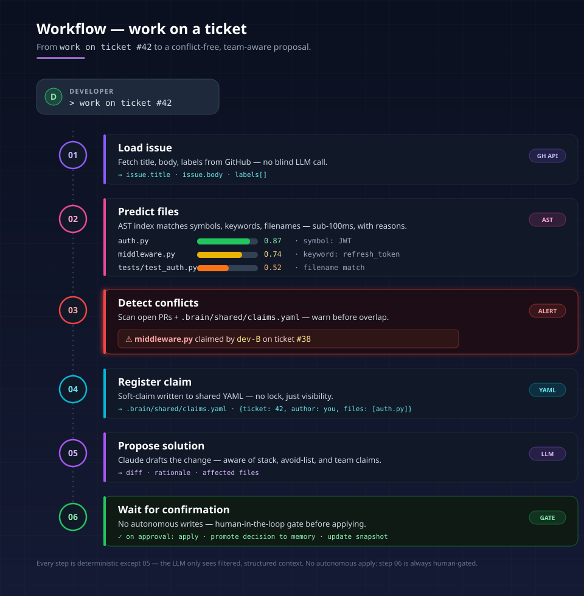
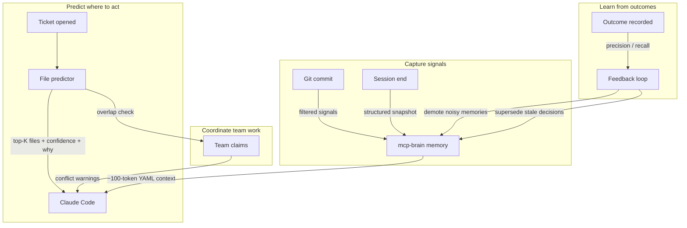
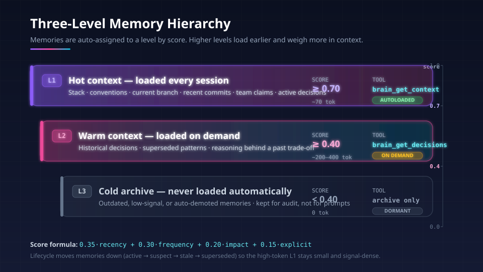
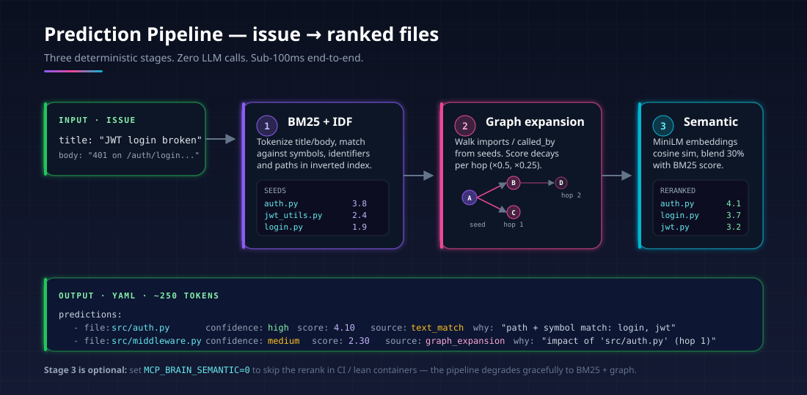
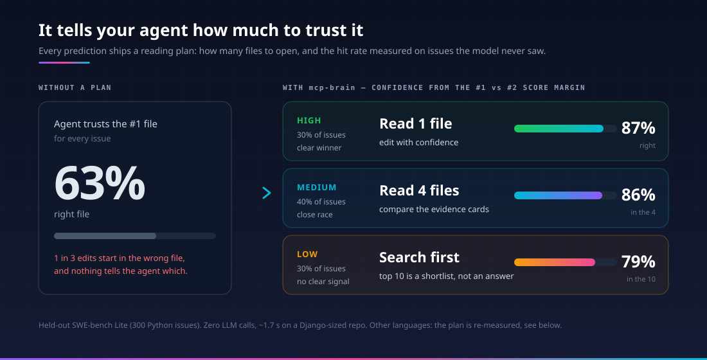
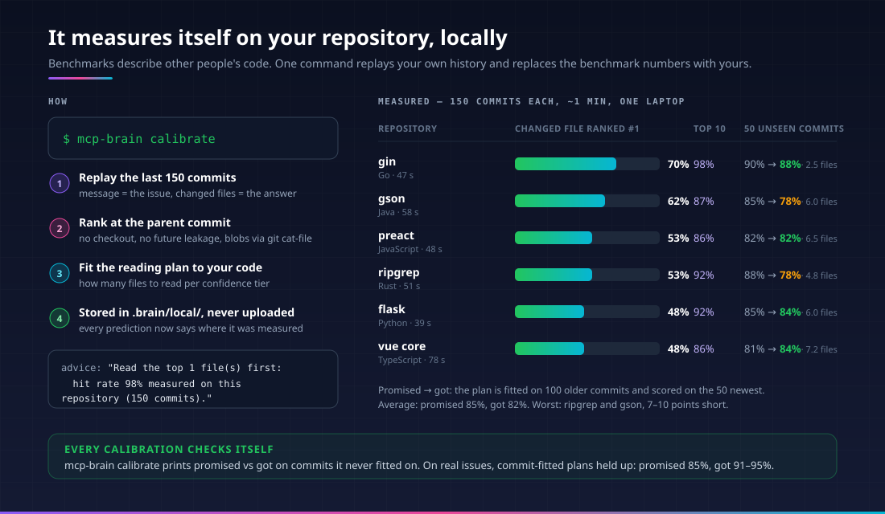
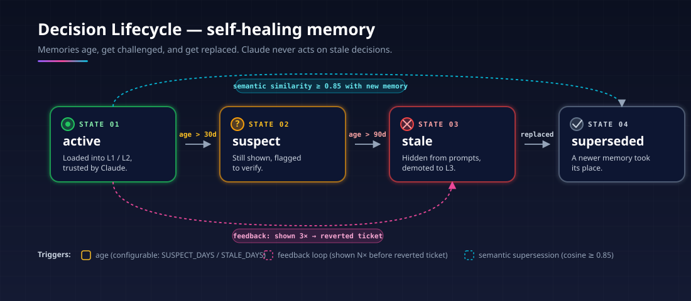
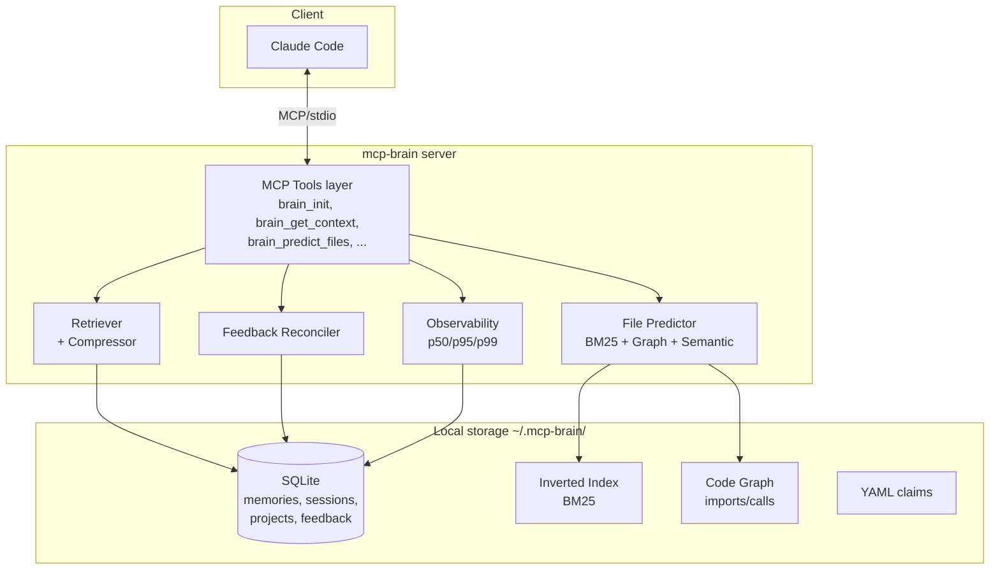
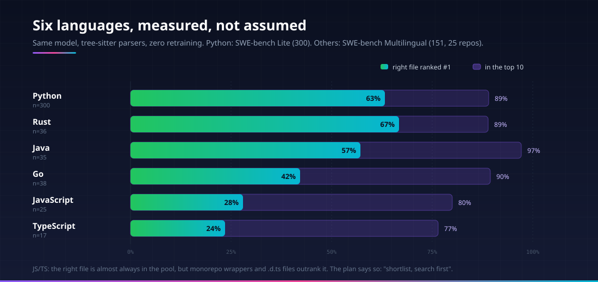
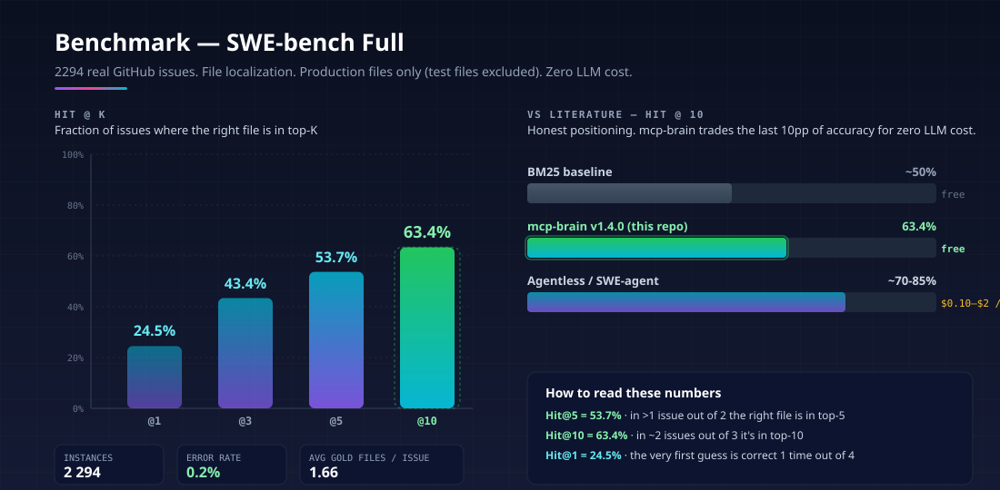

# mcp-brain

<p align="center">
  
</p>

<p align="center">
  <a href="#-benchmark-results"></a>
  <a href="#-self-calibration"></a>
  <a href="#-quick-start"></a>
  <a href="#-quick-start"></a>
  <a href="LICENSE"></a>
  
</p>

<p align="center">
  <b>The local-first, repo-aware memory and file-localization layer for coding agents.</b>
</p>

<p align="center">
  <i>Claude Code doesn't fail because it lacks intelligence.<br/>
  It fails because it has zero awareness of your repo and your team.</i>
</p>

---

## 🚀 TL;DR

**mcp-brain** is a Model Context Protocol (MCP) server that gives coding agents persistent, structured awareness of a project — without burning tokens on context rebuilding or requiring a cloud service.

|  🧠 | **Compressed awareness**: project context in a ~100-token YAML block           |
| :-: | :----------------------------------------------------------------------------- |
|  🎯 | **63.3% Hit@1 / 89.0% Hit@10** on held-out SWE-bench Lite — zero LLM cost     |
|  📏 | **Calibrated reading plan**: "read 1 file, 87% right" or "uncertain, search"   |
|  🔬 | **Self-calibration**: `mcp-brain calibrate` re-measures it on *your* Git history |
|  🌍 | **6 languages measured**: Python, Go, Rust, Java, JavaScript, TypeScript      |
|  ⚡  | **~1.7 s** warm prediction on a Django-sized repo, fully offline              |
|  👥 | **Team-aware**: soft claims, conflict detection, ownership tracking            |
|  🔄 | **Self-healing**: decision lifecycle, automatic staleness, feedback loop       |
| 🛡️ | **Local-first**: SQLite, no cloud, no embeddings required, GDPR-friendly       |

---

## 📑 Table of Contents

* [The Problem](#-the-problem)
* [What mcp-brain Changes](#-what-mcp-brain-changes)
* [In 60 seconds](#️-in-60-seconds)
* [How It Works](#-how-it-works)
* [Memory Hierarchy](#-memory-hierarchy)
* [Prediction Pipeline](#-prediction-pipeline)
* [Reading Plan](#-reading-plan)
* [Self-Calibration](#-self-calibration)
* [Decision Lifecycle](#-decision-lifecycle)
* [Architecture](#️-architecture)
* [Benchmark Results](#-benchmark-results)
* [Agent A/B](#-agent-ab-measured-not-estimated)
* [Quick Start](#-quick-start)
* [MCP Tools](#-mcp-tools)
* [Use Cases](#-use-cases)
* [FAQ](#-faq)
* [Trade-offs](#️-trade-offs)
* [Roadmap](#️-roadmap)
* [License](#-license)

---

## 🚨 The Problem

<p align="center">
  
</p>

Without persistent awareness, Claude Code operates **blindly** at the start of every session:

| Without mcp-brain                         | With mcp-brain                        |
| ----------------------------------------- | ------------------------------------- |
| ❌ No idea which files matter              | ✅ Predicted files in top-K            |
| ❌ Re-explores the repo every session      | ✅ Compressed context in ~100 tokens   |
| ❌ No visibility into teammates' WIP       | ✅ Soft claims + conflict detection    |
| ❌ Acts on outdated decisions              | ✅ Decision lifecycle (active → stale) |

**Result without mcp-brain:** wrong file exploration → outdated suggestions → merge conflicts.

---

## ⚡ What mcp-brain Changes

```
┌──────────────────────────────────────────────────────┐
│                                                      │
│   Without:  Claude → explores → guesses → retries    │
│             → conflicts                              │
│                                                      │
│   With:     Claude → predicts → verifies → acts      │
│             → aligned                                │
│                                                      │
└──────────────────────────────────────────────────────┘
```

### 🧬 Core idea

> Instead of giving Claude **more context**, we give it **structured awareness of reality**.

We track:

* 📌 what changed (signal extraction from git)
* 🎯 what matters (scoring + lifecycle)
* 👥 who's working on what (team claims)
* 🧭 where to act (issue → file prediction)

…and we deliver it **in ~100 tokens**.

---

## ⏱️ In 60 seconds

You drop a one-line ticket into Claude Code:

```
> work on ticket #42 — JWT login broken
```

**Without mcp-brain**, Claude starts grep-walking the repo, reading directory listings, opening README, sampling files. On famous open-source repos a strong model does this well (see [Agent A/B](#-agent-ab-measured-not-estimated)); on your private code it has no prior to lean on.

**With mcp-brain**, in about two seconds and without any LLM call, Claude receives:

```yaml
plan:
  confidence: high
  read_first: 1
  expected_hit: 0.867
  calibrated_on: "this repository (150 commits)"
  advice: "Read the top 1 file(s) first: hit rate 87% measured on this repository (150 commits)."
predictions:
  - file: src/auth.py
    confidence: high
    why: "path + symbol match: login, jwt"
  - file: src/middleware.py
    confidence: medium
    why: "imports auth (hop 1)"
  - file: src/jwt_utils.py
    confidence: medium
    why: "called_by auth.login"
team_claims:
  - { ticket: 39, author: dev-B, files: [middleware.py] }   # ⚠️ overlap
avoid:
  - "HS256 — vulnerable to key confusion. Migrated to RS256 in commit a1b2c3."
decisions:
  - "tokens stored in httpOnly cookie, never localStorage"
```

It's **structured reality**, not regenerated context. Claude can act on the first turn.

---

## 🔑 How It Works



1. **Capture** — git hooks promote only high-signal events (decisions, patterns, things to avoid). Ignored: docs, chore, tests, CI noise.
2. **Compress** — three-level memory (L1/L2/L3) auto-assigned by a scoring function (recency 35% + frequency 30% + impact 20% + explicit 15%).
3. **Predict** — issue title/body → evidence channels → learned ranker → ranked files plus a reading plan that says how many to open.
4. **Coordinate** — soft claims warn before two devs touch the same files.
5. **Self-correct** — every closed ticket feeds precision/recall stats; noisy memories are auto-demoted.

---

## 🧠 Memory Hierarchy

<p align="center">
  
</p>

Memories aren't dumped into one bag. They're **scored and tiered**, so the high-token slot in your prompt only carries what's signal-dense for *this* moment:

* **L1 — hot context** loads automatically every session. Stack, conventions, current branch, recent commits, team claims, active high-confidence decisions. Capped at ~70 tokens.
* **L2 — warm context** loads only on demand (`brain_get_decisions`). Historical reasoning, superseded patterns, the *why* behind a past trade-off.
* **L3 — cold archive** is never sent to the model. Kept for audit, transparency, and the lifecycle's "undo" path.

The score is a transparent linear formula — no black-box embedding similarity. Every memory's level is reproducible and explainable.

---

## 🔍 Prediction Pipeline

<p align="center">
  
</p>

Every candidate file is scored on **independent evidence channels**, then a
LambdaMART learning-to-rank model fuses them. The model ships as plain JSON trees
evaluated in pure Python: no NumPy, no GPU, no LLM call.

| Channel             | What it looks at                                                                 |
| ------------------- | -------------------------------------------------------------------------------- |
| **Text**            | BM25 over code terms, the issue title alone, file paths, and public API names   |
| **Code structure**  | Which file *defines* the mentioned symbols, qualified names, modules, importers |
| **Hard evidence**   | Stack-trace frames, literal error strings, literal file paths in the issue      |
| **Git history**     | Files that past fixes touched, recency, churn (only commits before HEAD)        |

Tests, build output and vendored copies (`dist/`, `build/`, `vendor/`,
`*.min.js`) are never candidates. Every prediction comes back with a `why` and,
on request, an **evidence card** (the matching lines), so the agent can audit
the ranking instead of trusting it.

> 💡 `verify_local=true` lets a local model (llama-server, Ollama, vLLM) rerank
> the evidence cards. Opt-in; public endpoints are refused.

---

## 📏 Reading Plan

<p align="center">
  
</p>

A ranked list alone hides the important part: **how much to trust it**. The
score margin between the first and second file is a reliable confidence
signal, so every answer carries a `plan`:

```yaml
plan:
  confidence: high          # high | medium | low
  read_first: 1             # open this many files before editing
  expected_hit: 0.867       # measured, not guessed
  calibrated_on: held-out swebench_lite (300 issues)  # or "this repository (150 commits)"
```

A `low` plan is a feature, not a failure: it tells the agent to search before
editing instead of confidently opening the wrong file.

---

## 🔬 Self-Calibration

<p align="center">
  
</p>

Benchmark numbers describe other people's code. One command measures mcp-brain
on **yours**:

```bash
mcp-brain calibrate
```

```
measuring on up to 150 recent commits of /src/gin (local, nothing leaves this machine)...
  150/150 commits
measured on 150 commits in 47.0 s
changed file found in   top-1: 70%   top-3: 89%   top-5: 95%   top-10: 98%
reading plan (target 85%):
  high     45 commits   read 1 file    -> 98%
  medium   60 commits   read 3 files   -> 90%
  low      45 commits   read 4 files   -> 87%
check on the newest 50 commits (not used to fit): promised 90%, got 88%, reading 2.5 files on average
saved .brain/local/calibration.json; brain_predict_files now uses it.
```

How it works: each recent commit that modified 1–5 source files becomes a test
case. Its message plays the issue, the files it changed are the answer, and the
index is rebuilt **at the parent commit** straight from Git objects (no
checkout, no leakage from the future). The fitted tiers are written to
`.brain/local/calibration.json` and every later prediction says
`calibrated_on: this repository (150 commits)`.

**It checks its own promise.** Before saving, `calibrate` fits the plan on the
older two thirds of the commits and scores it on the newest third, which it
never saw. That check is printed, so you know whether to trust the plan:

| Repository | Language   | Top-1 | Top-10 | Newest 50 commits: promised → got | Files read |
| ---------- | ---------- | ----- | ------ | --------------------------------- | ---------- |
| gin        | Go         | 70%   | 98%    | 90% → 88%                         | 2.5        |
| gson       | Java       | 62%   | 87%    | 85% → **78%**                     | 6.0        |
| preact     | JavaScript | 53%   | 86%    | 82% → 82%                         | 6.5        |
| ripgrep    | Rust       | 53%   | 92%    | 88% → **78%**                     | 4.8        |
| flask      | Python     | 48%   | 92%    | 85% → 84%                         | 6.0        |
| vue core   | TypeScript | 48%   | 86%    | 81% → 84%                         | 7.2        |
| **Average**|            |       |        | **85% → 82%**                     | **5.5**    |

Each check has only 50 commits (±10 points), so read single rows loosely; on
average the plan over-promises by about 3 points. Compared with the generic
benchmark plan on the same commits, the local plan reads ~30% fewer files for
a few points less hit rate: it tunes the trade-off to your repository, it
does not make the ranking itself more accurate.

**Is a commit message a fair stand-in for an issue?** It is a harder one.
On the 291 SWE-bench Lite issues linked to their fix commits, plans fitted on
the commit messages promised 85% and delivered **91–95%** on the real issue
text.

When the margin does not separate a repository's commits (Flask above), the
plan falls back to one honest tier instead of inventing confidence.

---

## 🔄 Decision Lifecycle

<p align="center">
  
</p>

Memories aren't immortal. mcp-brain **assumes you'll change your mind** and bakes the lifecycle in:

* **Age-based decay** — after `SUSPECT_DAYS` a memory gets flagged for re-verification. After `STALE_DAYS` it's hidden from prompts.
* **Semantic supersession** — write a new memory similar (cosine ≥ 0.85) to an old one and the old one is auto-marked `superseded`.
* **Feedback loop** — when a memory is shown 3+ times before a *reverted* ticket, it gets demoted automatically. Noisy memories die fast.

This is what makes mcp-brain **safe to leave running for months** without manual cleanup. The L1 stays small and trustworthy; the L3 archives the audit trail.

---

## 🏗️ Architecture

<p align="center">
  
</p>



### Repo layout

```
mcp-brain/
├── src/
│   ├── brain/         # core logic: retriever, compressor, scorer, predictor
│   │                  # code_graph, file_indexer, semantic_reranker,
│   │                  # staleness, similarity, feedback loop, observability
│   ├── capture/       # git hook signal extraction
│   ├── storage/       # SQLite layer
│   └── tools/         # MCP tool definitions (FastMCP)
├── benchmark/         # SWE-bench Lite/Full, Bench4BL, BugLocator harness
├── tests/             # pytest suite (predictor, feedback, observability, ...)
└── assets/            # SVG diagrams used in this README
```

---

## 📊 Benchmark Results

We benchmark **file localization** — *given a real GitHub issue, can mcp-brain rank the production files the accepted patch actually modified?*

### Current learned localizer — held-out SWE-bench Lite

The shipped LambdaMART model (`src/brain/localizer_model.json`) is trained on
SWE-bench Full instances **outside** SWE-bench Lite and evaluated on the 300 Lite
issues. The repositories overlap with training; leave-one-repository-out
cross-validation gives a similar Hit@1 (~62–66%).

| Metric | @1    | @3    | @5    | @10   |
| ------ | ----- | ----- | ----- | ----- |
| Hit    | 63.3% | 81.7% | 85.0% | 89.0% |

**Calibrated reading plan.** The margin between the first and second candidate
is a reliable confidence signal. Every localizer answer carries a `plan` fitted
on the same held-out issues (`python -m benchmark.loclab calibrate`):

| Tier   | Share of issues | `read_first` | Held-out hit rate |
| ------ | --------------- | ------------ | ----------------- |
| high   | 30%             | 1 file       | 86.7%             |
| medium | 40%             | 4 files      | 85.8%             |
| low    | 30%             | 10 files     | 78.9%             |

A `low` plan tells the agent that localization is uncertain and it should search
before editing.

**Other languages — SWE-bench Multilingual.**

<p align="center">
  
</p>

The same Python-trained model, run
without retraining on the 151 Multilingual issues in supported languages (Go,
Rust, Java, JavaScript, TypeScript; 25 repositories). Build output and vendored
copies (`dist/`, `build/`, `vendor/`, `*.min.js`) are excluded from candidates.

| Language   | n   | Hit@1 | Hit@3 | Hit@5 | Hit@10 |
| ---------- | --- | ----- | ----- | ----- | ------ |
| Rust       | 36  | 66.7% | 80.6% | 80.6% | 88.9%  |
| Java       | 35  | 57.1% | 91.4% | 97.1% | 97.1%  |
| Go         | 38  | 42.1% | 60.5% | 76.3% | 89.5%  |
| JavaScript | 25  | 28.0% | 56.0% | 72.0% | 80.0%  |
| TypeScript | 17  | 23.5% | 58.8% | 70.6% | 76.5%  |
| All        | 151 | 47.0% | 71.5% | 80.8% | 88.1%  |

The Python margin tiers do **not** transfer: their `high` tier held 64.9% here,
not 86.7%. When the top file is not Python the plan therefore uses a single
pooled tier fitted on these issues: `low`, read 8 files, 86.8% overall (JS 80%,
TS 76%). Treat JS/TS predictions as a shortlist, not an answer.

The v1.4.0 numbers below are kept for history (BM25 + graph, before the learned
localizer).

<p align="center">
  
</p>

### Dataset: SWE-bench Full

* **2294 real Python bug-fix tasks** from major OSS projects (astropy, django, flask, matplotlib, pandas, pytest, requests, scikit-learn, sphinx, sympy, xarray)
* Ground truth = files modified in the accepted reference patch (test files **excluded** by default — strict production-file evaluation)

### Results — `mcp-brain` v1.4.0 (BM25 + graph + semantic)

> These are the last fully reproduced numbers for the previous pipeline. The
> personalized graph/role-aware pipeline must be rerun on the complete pinned
> dataset before publishing replacement metrics; replay estimates are not
> presented as benchmark results.

| Metric     |    @1 |    @3 |    @5 |       @10 |
| ---------- | ----: | ----: | ----: | --------: |
| **Hit**    | 24.5% | 43.4% | 53.7% | **63.4%** |
| **Recall** | 20.1% | 36.6% | 46.1% |     55.8% |
| **MAP**    | 24.5% | 28.4% | 30.4% |     31.8% |

* **Instances evaluated**: 2294
* **Errors**: 5 (0.2% failure rate)
* **Avg gold files per issue**: 1.66
* **Avg predicted files**: 9.98 (top-10)

### Honest comparison vs. literature

| System                  | Hit@10 (file loc.) | Cost per query | Notes                             |
|-------------------------| ------------------ | -------------- | --------------------------------- |
| BM25 baseline (vanilla) | ~45–55%            | free           | symbol search only                |
| **mcp-brain v1.4.0**    | **63.4%**          | **free**       | BM25 + graph + semantic, zero LLM |
| Agentless / SWE-agent   | ~70–85%            | $0.10–$2       | LLM-based, multi-step             |

**Reading the numbers:**

* `Hit@5 = 53.7%` → in **more than half** of real issues, the right production file is in top-5 *before Claude reads a single byte*.
* `Hit@10 = 63.4%` → expanded to top-10, almost **2 issues out of 3** have the right file ranked.
* `MAP@1 = 24.5%` → the very first prediction is dead-on for **1 issue out of 4**.
* `0.2% error rate` over 2294 runs → robust pipeline.

### Reproduce it yourself

```bash
# One-time online setup
pip install -e .
pip install -r benchmark/requirements-benchmark.txt
python -m benchmark.adapters.swebench --dataset-name princeton-nlp/SWE-bench \
  --output benchmark/datasets/cache/swebench_full.jsonl
python -m benchmark.prepare_repos \
  --dataset benchmark/datasets/cache/swebench_full.jsonl \
  --repo-cache benchmark/repos

# Offline evaluation (full)
python -m benchmark.run_eval \
  --dataset benchmark/datasets/cache/swebench_full.jsonl \
  --repo-cache benchmark/repos \
  --out benchmark/results/swebench_full.json \
  --report-dir benchmark/reports \
  --top-k 10 --max-hops 2 --use-semantic
```

Reports are emitted as Markdown + HTML in `benchmark/reports/`.

The harness also supports SWE-bench Lite (300 instances), SWE-bench Verified, Bench4BL, and BugLocator — see [`benchmark/README.md`](benchmark/README.md).

---

## 🧪 Agent A/B (measured, not estimated)

Earlier versions of this README estimated token savings. We then measured them:
Claude Code runs headless on 30 SWE-bench Lite issues, twice per issue, with
read-only tools. Both arms see the same issue at the same base commit; one arm
also has `brain_predict_files` and is told to call it first. The answer is
scored on the first file named.

| Model  | Arm       | Hit@1 | Cost / issue | Turns | Input tokens | Wall time |
| ------ | --------- | ----: | -----------: | ----: | -----------: | --------: |
| Sonnet | baseline  | 100%  | $0.029       | 2.2   | 38k          | 11 s      |
| Sonnet | mcp-brain | 96.7% | $0.035       | 3.1   | 56k          | 42 s      |
| Haiku  | baseline  | 93.3% | $0.132       | 17.6  | 584k         | 64 s      |
| Haiku  | mcp-brain | 93.3% | $0.156       | 21.0  | 731k         | 82 s      |

**On these issues mcp-brain did not help.** Accuracy was already at the
ceiling, and calling the tool adds a turn, so cost goes up 18–20%. SWE-bench
repositories (Django, SymPy, pytest…) are famous; the models know where things
live without being told. The test says nothing yet about private code the
model has never seen, which is where a localizer should matter. That is the
next measurement, not a claim.

Reproduce (needs Claude Code logged in; the scratch dir must be outside this checkout):

```bash
python -m benchmark.agent_ab --n 30 --model sonnet --scratch /tmp/ab --out benchmark/results/agent_ab_sonnet_30.json
```

Raw results: `benchmark/results/agent_ab_{sonnet,haiku}_30.json`.

---

## 🚀 Quick Start

### Install — one command, batteries included

```bash
git clone https://github.com/PierfrancescoLijoi/mcp-brain.git
cd mcp-brain
pip install -e ".[all]"
```

The `[all]` extra installs:

* **language parsers** (Python, JS, TS, Go, Rust, Java, C#) for the code graph
* **semantic reranker** (sentence-transformers + numpy)
* **dev tooling** (pytest, pytest-cov)

### Lean install paths

If you want a smaller footprint, you can pick exactly what you need:

```bash
pip install -e .                      # core only — BM25 + graph (no semantic, no parsers)
pip install -e ".[parsers]"           # + multi-language parsers
pip install -e ".[semantic]"          # + semantic reranker (~700 MB w/ PyTorch)
pip install -e ".[dev]"               # + dev tooling
```

### Register with Claude Code

```bash
claude mcp add mcp-brain -- mcp-brain-server
```

The MCP server is client-neutral; Claude Code is only one registration example.

### Optional fully local verifier

`brain_predict_files` can return compact evidence cards or rerank them with a
local OpenAI-compatible model by passing `verify_local=true`. The reference
deployment is `llama-server` bound to `127.0.0.1`; Ollama, vLLM, and LocalAI use
the same client contract.

Local reranking is opt-in and experimental: the deterministic retriever remains
the production default until a model clears the documented promotion gates.

```powershell
$env:MCP_BRAIN_VERIFIER_URL = "http://127.0.0.1:8080/v1"
$env:MCP_BRAIN_VERIFIER_MODEL = "your-local-code-model"
mcp-brain doctor
```

Public endpoints are rejected by default. Invalid responses, timeouts, and low
confidence overrides remain visible and fall back to the deterministic ranking.
See [the on-prem deployment and promotion contract](benchmark/ON_PREM_VERIFIER.md).

The installed entry point starts the server in the current repository, so the
same command works on Windows, macOS, and Linux.

### Initialize and verify your project

```bash
mcp-brain init
mcp-brain doctor
mcp-brain calibrate   # optional, ~1 min: measure predictions on your own history
```

`init` installs a portable post-commit hook without overwriting an unrelated
hook. If one already exists, mcp-brain creates `post-commit.mcp-brain` and tells
you to chain it. `doctor` checks the repository, hook, parsers, and optional
semantic layer. `calibrate` replays recent commits and stores a reading plan
measured on this repository (see [Self-Calibration](#-self-calibration)).

### Optional Jev companion

Jev can run beside mcp-brain as a separate MCP decision service:

```bash
claude mcp add jev -- jev mcp serve --model jev-1.13.0 \
  --max-cost-usd-per-call 0.001
```

This separation is intentional: mcp-brain remains local-first and deterministic,
while Jev can be called only at ambiguous decision boundaries. Jev request
validation is offline and free, but model calls require a TypeSafe API key and
may consume paid credits. See the
[official Jev MCP guide](https://github.com/shaharia-lab/jev-cli/blob/main/docs/user-guide/mcp.md).

That's it. Open Claude Code in your repo and the L1 context is automatically
available via `brain_get_context`.

---

## 🧠 MCP Tools

| Tool                   | Purpose                                     | When Claude calls it           |
| ---------------------- | ------------------------------------------- | ------------------------------ |
| `brain_init`           | Register project, stack, conventions        | Once per repo                  |
| `brain_get_context`    | Load L1 context (~70 tokens)                | Every session start            |
| `brain_get_decisions`  | Load L2 decisions on demand                 | When historical context needed |
| `brain_remember`       | Store a memory; level auto-assigned         | When user makes a decision     |
| `brain_save_session`   | Save end-of-session snapshot                | At session end                 |
| `brain_predict_files`  | Issue → ranked file list with `why`         | When opening a ticket          |
| `brain_start_ticket`   | Start ticket workflow + conflict check      | Workflow orchestration         |
| `brain_record_outcome` | Log ticket outcome (completed/reverted/...) | After ticket closed            |
| `brain_feedback_stats` | Precision/recall window                     | Health checks                  |
| `brain_memory_health`  | Surface noisy memories                      | Debugging                      |
| `brain_observability`  | Full unified dashboard (YAML)               | Ops / CI                       |

### Example L1 context output (~100 tokens)

```yaml
p: {name: my-api, stack: [FastAPI, PostgreSQL]}
s: {branch: feat/auth, wip: "JWT refactor", next: "add refresh token"}

git:
  recent: ["refactor: JWT moved to RS256"]
  changed: [auth.py, middleware.py]

team_claims:
  - {ticket: 42, author: dev-B, files: [middleware.py]}

avoid:
  - "avoid: HS256 — vulnerable to key confusion"

decisions:
  - "decision: tokens stored httpOnly cookie, never localStorage"
```

👉 Claude **already knows where to act** before reading a single source file.

---

## 💼 Use Cases

### 🎯 Solo developer

* Remembers your "I always do it this way" patterns
* Auto-supersedes decisions when you change your mind

### 👥 Small team (3–10 devs)

* **Conflict detection** before two devs touch the same files
* Shared decision log with lifecycle (no more "wait, didn't we decide…?")
* File ownership inference from git history

### 🏢 Enterprise (with caveats)

* Local-first, no data leaves the machine → **GDPR / SOC2-friendly**
* Compatible with Managed Identity / on-prem deployments (no cloud calls)

---

## ❓ FAQ

<details>
<summary><b>Is this a RAG system or a vector DB?</b></summary>

**No, and on purpose.** mcp-brain is a *structured awareness layer*, not a retrieval-over-embeddings layer. The core retrieval is multi-channel BM25, definitions, tracebacks, imports and Git history fused by a small tree model — fully deterministic, no vector DB to maintain. The semantic reranker is an optional 30% blend on top, used only as a tiebreaker. This is why token cost stays predictable and infra is local-first.

</details>

<details>
<summary><b>Why not just use Claude's native context window? It's huge now.</b></summary>

A long context window doesn't fix the problem — it makes it cheaper to *waste*. The bottleneck isn't capacity, it's **signal density**. Pasting your whole repo into the context still leaves Claude searching for the right file linearly. mcp-brain pre-ranks reality so the model spends its attention on the right 3 files, not the wrong 30.

</details>

<details>
<summary><b>Will it leak my code or memories anywhere?</b></summary>

No. Storage is SQLite under `~/.mcp-brain/` (local) and `<repo>/.brain/shared/` (versioned with git if you choose). No outbound network calls, no telemetry, no cloud component. The semantic model runs on your CPU/GPU. This makes mcp-brain compatible with GDPR-restricted and air-gapped environments.

</details>

<details>
<summary><b>What if I disagree with a decision mcp-brain remembers?</b></summary>

Write a new memory that contradicts it. Semantic supersession (cosine ≥ 0.85) will auto-mark the old one as `superseded`. You can also manually demote via `brain_memory_health` or wait for age-based decay (`SUSPECT_DAYS` / `STALE_DAYS`). The lifecycle assumes you'll change your mind.

</details>

<details>
<summary><b>Does it work with languages other than Python?</b></summary>

Yes for indexing/predicting (BM25 is language-agnostic). The code graph currently supports **Python, JavaScript, TypeScript, Go, Rust, Java, C#** via tree-sitter parsers. Adding a new language is a single registry entry — see `src/brain/parsers.py`.

</details>

<details>
<summary><b>How does it compare to SWE-agent / Aider / Cursor?</b></summary>

Different layer of the stack. SWE-agent and similar tools are **autonomous coders** — they read, plan, and patch via LLM calls. mcp-brain is the **awareness layer underneath** them. You could pair it with Aider or any MCP-compatible client; it makes whatever LLM you use start from a smarter zero.

</details>

<details>
<summary><b>What's the catch?</b></summary>

Honest answer: file prediction is statistical. `Hit@1 = 63.3%` on held-out issues means about 1 issue in 3 still needs the agent to look further. The calibrated `plan` says which case you are in: in the `low` tier (30% of issues) the right file is in the top 10 only 79% of the time. mcp-brain *orients*, it doesn't *replace* exploration. That's also why it's free — it's a force multiplier, not an oracle.

</details>

---

## ⚠️ Trade-offs

I'm honest about what this is and isn't.

| Strength                                      | Limitation                                                             |
| --------------------------------------------- | ---------------------------------------------------------------------- |
| ✅ Zero LLM cost for retrieval                 | ⚠️ Heuristic-based: edge cases with no symbol/path overlap can miss    |
| ✅ Calibrated "how many files to read" plan    | ⚠️ Trained on Python; Go/Rust/Java usable, JS/TS weak (Hit@1 ~25%) |
| ✅ Local-first, no cloud                       | ⚠️ No cross-machine sync out of the box (use git for `.brain/shared/`) |
| ✅ Deterministic (replays produce same output) | ⚠️ Hit@1 = 63.3% → orients, doesn't replace exploration                |
| ✅ Works on any size repo                      | ⚠️ Best on medium/large repos (small repos don't benefit much)         |
| ✅ Self-calibrates on your own Git history     | ⚠️ Needs ≥30 usable commits; commit messages understate issue accuracy |

**This is NOT**:

* ❌ a vector DB memory
* ❌ a RAG system
* ❌ an SWE-agent / autonomous coder
* ❌ a checkpoint / replay tool

**This IS**:

* ✅ a repo-aware, team-aware, **token-efficient awareness layer**
* ✅ a force multiplier for Claude Code, not a replacement

---

## 🛣️ Roadmap

* [x] BM25 + code graph + semantic reranker
* [x] Decision lifecycle with semantic supersession
* [x] Feedback loop with precision/recall reconciliation
* [x] Observability dashboard
* [x] SWE-bench Full benchmark (2294 instances)
* [x] Multi-language code graph (Python, JS, TS, Go, Rust, Java, C#)
* [x] Learned localizer (LambdaMART, JSON trees, pure Python)
* [x] Calibrated reading plan + evidence cards
* [x] Self-calibration on the repository's own history (`mcp-brain calibrate`)
* [x] Agent A/B harness with real Claude Code runs (`benchmark/agent_ab.py`)
* [ ] Agent A/B on private / post-cutoff repositories, where the model has no prior
* [ ] Re-calibrate automatically from the post-commit hook
* [ ] Cross-repo memory federation (opt-in)
* [ ] Real-time conflict push (currently pull-based)
* [ ] VS Code extension companion
* [ ] Hosted shared `.brain/` for distributed teams (still local-first per dev)

---

## 🧪 Run the test suite

```bash
pip install -e ".[dev]"
pytest tests/ -v
```

Expected: full pass on Python 3.10, 3.11, 3.12.

---

## 🤝 Contributing

PRs welcome. Before opening one:

1. `pytest tests/ -v` must pass
2. New behavior needs new tests
3. New MCP tools must be wrapped with `@observed("brain_<name>")`
4. Avoid heavy dependencies for the default install path — anything ML-flavored goes behind an optional extra

---

## 📄 License

MIT — see [LICENSE](LICENSE).

---

<p align="center">
  <b>Built for Claude Code — but the architecture is MCP-standard, so any MCP-compatible client works.</b>
</p>

<p align="center">
  <sub>If mcp-brain is useful to you, ⭐ the repo. That's the only payment I ask for.</sub>
</p>
