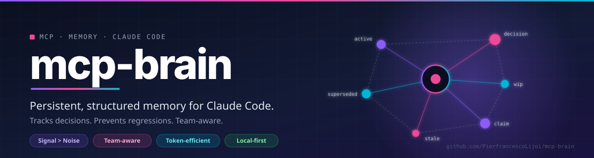
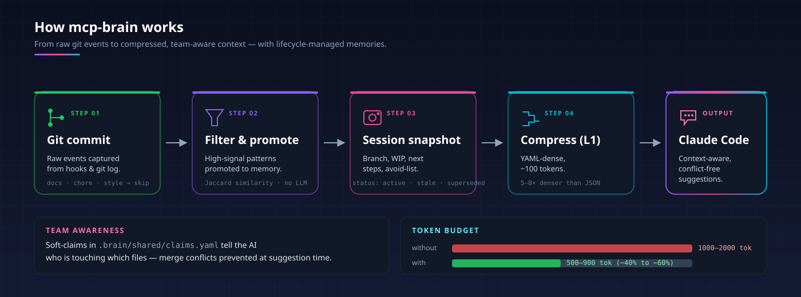

# mcp-brain

  

> Claude Code doesn’t fail because it lacks intelligence.  
> It fails because **it has zero awareness of your repo and your team.**

**mcp-brain turns Claude into a repo-aware, team-aware engineer.**

---

## 🚀 What this is (in one sentence)

> **An awareness layer for AI coding — not just memory.**

---

## 🧠 The real problem

Claude Code operates blindly:

- no understanding of repo structure  
- no awareness of recent changes  
- no visibility into team activity  
- no notion of outdated decisions  

Result:

- wrong file exploration  
- outdated suggestions  
- merge conflicts  
- wasted tokens rebuilding context  

---

## ⚡ What mcp-brain changes

Without:
Claude → explores → guesses → retries → conflicts

With:
Claude → predicts → verifies → acts → aligned with repo & team

---

## 🧬 Core idea

Instead of giving more context,

👉 **we give structured awareness of reality**

- what changed  
- what matters  
- who is working on what  
- where to act  

---

## 🔑 How it works

git commit        → signals captured (filtered)  
session end       → structured snapshot saved  
new session       → compressed awareness injected (~100 tokens)  
ticket opened     → files predicted + conflicts detected  

---

## 🧠 Awareness system (not memory system)

### 1. Signal extraction (Git as truth)

- commits = raw signal stream  
- only high-signal patterns promoted  
- noise ignored automatically  

Ignored:
docs / chore / test / ci  

---

### 2. Decision lifecycle

Every decision evolves:

- active  
- suspect  
- stale  
- superseded  

New changes automatically invalidate old decisions.

No embeddings.  
No vector DB.  
Zero latency overhead.

---

### 3. Predictive repo understanding

Before touching code, Claude knows:

- which files matter  
- why they matter  
- how confident that prediction is  

---

### 4. Team awareness layer

Claude understands:

- who is working on what  
- which files are in progress  
- where conflicts may happen  

Enables:

- soft file claims  
- conflict warnings before coding  
- coordination across developers  

---

## ✨ What makes it different

This is NOT:

- a vector database  
- a RAG system  
- a memory checkpoint tool  

This IS:

- repo-aware AI behavior  
- team-aware execution  
- predictive file navigation  
- lifecycle-aware decisions  

---

## ✨ Features

### 🧠 Awareness engine
- Structured project state (not raw context)
- Lifecycle-based decision tracking
- Staleness + supersession detection

### 🔍 Prediction engine
- Issue → file prediction (AST-based)
- Explanation (why) + confidence
- Sub-100ms resolution

### 👥 Team coordination
- Soft claims (.brain/shared/claims.yaml)
- Conflict detection (PR + WIP overlap)
- Shared vs local memory separation

### ⚡ Performance-first
- No embeddings
- No vector DB
- Incremental updates
- YAML compressed context (5–8x denser)

---

## 🧠 Example

Claude receives:

p: {name: my-api, stack: [FastAPI, PostgreSQL]}  
s: {branch: feat/auth, wip: "JWT refactor", next: "add refresh token"}  

git:  
  recent: ["refactor: JWT moved to RS256"]  
  changed: [auth.py, middleware.py]  

team_claims:  
  - {ticket: 42, author: dev-B, files: [middleware.py]}  

👉 Claude already knows where and how to act.

---

## 🚀 Quick start

git clone https://github.com/PierfrancescoLijoi/mcp-brain.git  
cd mcp-brain  
pip install -e .  

claude mcp add mcp-brain python /absolute/path/to/run.py  

mcp-brain init  

---

## 🏗️ Architecture

  

claude-code  <-- MCP -->  mcp-brain  

src/  
  storage/  
  brain/  
  capture/  
  tools/  

---

## ⚠️ Trade-offs

- Heuristic-based (no embeddings)
- Requires good commit hygiene
- Optimized for medium/large repos

---

## 💡 Positioning

mcp-brain is not trying to be:

- a knowledge base  
- a memory database  
- a generic MCP plugin  

It is:

> **a coordination and awareness layer for AI-assisted development**

---

## 📄 License

MIT
